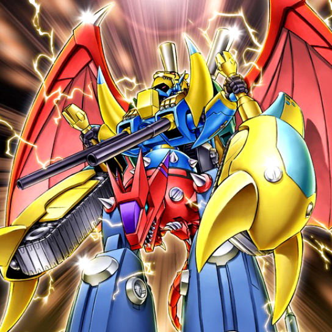
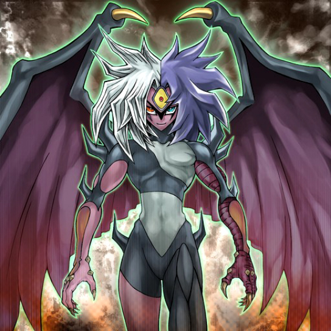
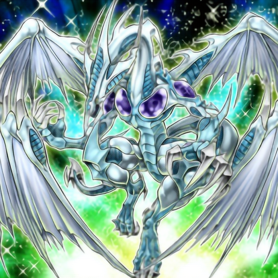

# SRGAN for YGO
This is a super resolution examples for ygo cards' image. It works under [TensorFlow](https://www.tensorflow.org) 1.7 and the [TensorLayer](https://github.com/tensorlayer/tensorlayer) 1.8.0+. And this repository refers to [tensorlayer/srgan](https://github.com/tensorlayer/srgan).

## SRGAN Architecture
TensorFlow Implementation of ["Photo-Realistic Single Image Super-Resolution Using a Generative Adversarial Network"](https://arxiv.org/abs/1609.04802)

## Results
Here are some results from SRGAN algorithm (from left to right are bicubic, generator and high resolution):

  
  
  

  
  
  

  
  
  

  
  
  

  
  
  

## Reference
* [1] [Photo-Realistic Single Image Super-Resolution Using a Generative Adversarial Network](https://arxiv.org/abs/1609.04802)
* [2] [Is the deconvolution layer the same as a convolutional layer ?](https://arxiv.org/abs/1609.07009)